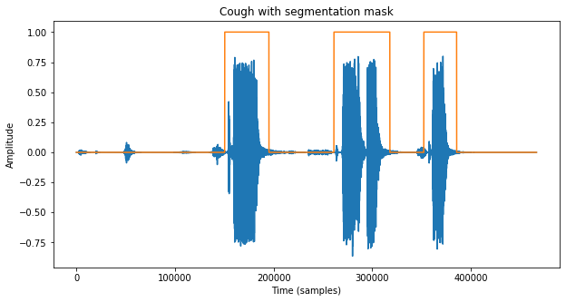
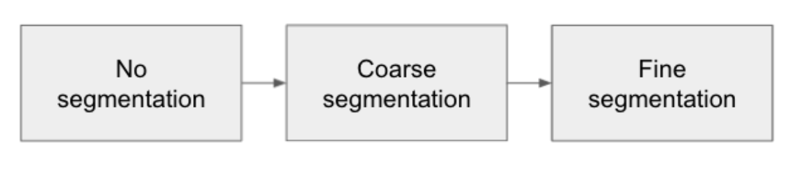
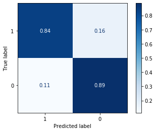
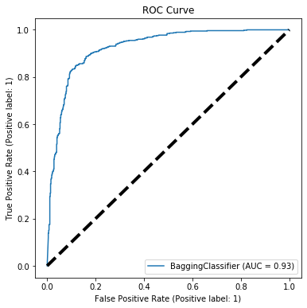
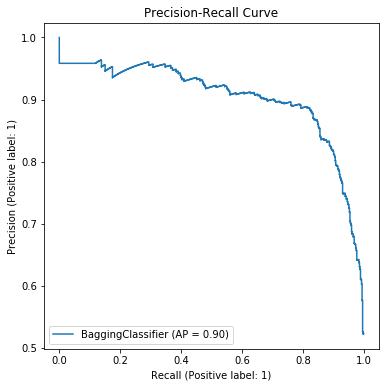

# COVID Cough Classifier ReadMe

This repository contains notebooks for my Capstone Project completed during General Assembly's Data Science Immersive course.

**Introduction and Aims**

This project seeks to explore the potential of audio analysis and machine learning in predicting whether a person has COVID-19 from a sample of their cough. Using a variety of features extracted from the audio samples, I aim to evaluate the performance of different classification models and discuss the limitations. 

**Scope**

COVID-19 has changed the world we live in. As of June 2021 there have been 3.8m deaths globally and most countries have restrictive measures in place to try halt the spread of the virus. Testing plays a key role in our efforts to contain and mitigate the COVID-19 pandemic. By identifying infected individuals we can help prevent further person-to-person transmission through individual isolation or localised lockdowns. While testing has become more widespread, there remains a need for inexpensive, rapid, and scalable COVID-19 screening technology.  An app leveraging signal processing and machine learning to detect covid could fill this gap!

**Dataset**

The COUGHVID dataset provides over 20,000 crowdsourced cough recordings representing a wide range of subject ages, genders, geographic locations, and COVID-19 statuses. Furthermore, experienced pulmonologists labeled 2,500 recordings to diagnose medical abnormalities present in the coughs. This subset had been confirmed by human ear to contain coughs while the other samples in the dataset had not. Of these 2,500 recordings 1,500 were either healthy or positive for COVID, this is the subset I chose to use in my modelling process. The remaining 1,000 samples were symptomatic but it was not confirmed if they were positive so I decided to drop these from the dataset. The audio files were in .ogg and .webm format, I converted them both to .wav before starting the feature extraction process.

## Feature extraction and Pre-processing 

**Sample Segmentation**

Each audio file was 3-10 seconds long and contained multiple coughs that had been confirmed present by an expert pulmonologist. Although each sample contained a cough, I discovered some contained other background noises such as speech or traffic and every sample contained different amounts or silence/background noise between coughs.  I decided to segment the samples into individual coughs using a function. This would hopefully remove the unwanted background noise and silence in between the coughs and make the new samples more comparable. Initially this resulted in 3827 segments which I then used as my observations. The graph below shows an example of the segmentation function on an individual sample.

    

Further along in my project, after some initial modelling, I decided to re-segment the data as I noticed multiple coughs were still being grouped together. Using different parameters in the segmentation function I was able to more finely segment data resulting this time in 6,090 observations.  

**Audio Features**

After much reading around the subject of audio analysis and reading papers on cough classification I decided to use the following audio features as predictors: 

* Mel Frequency Cepstral Coefficients
* Spectral Features
* Zero Cross Rate
* Root Mean Squared

These were extracted using the python package Librosa. 

## Modelling

When modelling I explored Logistic Regression, KNN, Decision Tree, SVM models as well as ensemble methods. I used grid search and cross validation to tune each models’ parameters. I started modelling using the original subset of data, then saw improvement using the segmented dataset and then saw further improvement using the more finely segmented dataset.

    

For the finer segmentation I got the following CV scores:

<table>
  <tr>
   <td><strong>Model</strong>
   </td>
   <td><strong>CV Score</strong>
   </td>
  </tr>
  <tr>
   <td>Baseline
   </td>
   <td>0.52
   </td>
  </tr>
  <tr>
   <td>Logistic Regression
   </td>
   <td>0.57
   </td>
  </tr>
  <tr>
   <td>Decision Tree
   </td>
   <td>0.57
   </td>
  </tr>
  <tr>
   <td>Random Forest
   </td>
   <td>0.68
   </td>
  </tr>
  <tr>
   <td>SVM (rbf)
   </td>
   <td>0.77
   </td>
  </tr>
  <tr>
   <td>KNN
   </td>
   <td>0.79
   </td>
  </tr>
  <tr>
   <td>Bagging Classifier (KNN)
   </td>
   <td>0.82
   </td>
  </tr>
</table>

The bagging classifier model provided the highest cross validation score of 0.82 well above baseline. 

## Evaluation

For the bagging classifier KNN model, a ROC-AUC score of 0.93 was achieved as shown in the below ROC curve graph. This is a large improvement from the Logistic Regression model that scored 0.63. Accurately predicting the positive class is particularly important in this project. False negatives would be very costly as people who were COVID positive would be classed negative and would continue to spread the virus. A recall of 0.84 for the positive class is much higher than baseline but still 0.16 of positive cases would be labeled incorrectly. 

    

    

    

**Limitations & Further Steps**

One of the biggest challenges with this project is the recording quality and presence of other audio signals in the recordings which are not related to the cough. Isolating just the cough sound is key to being able to extract representative audio features that can then be used in the model. To try to improve this a classification model to detect the presence of a cough could be used to help tune the segmentation function for each sample. This would hopefully be more effective at removing unwanted noise, resulting in a better performing model.

Accuracy is extremely important when testing for COVID, training and testing the model using a larger dataset would definitely be a good next step. Also exploring further modelling methods such as neural nets and using additional features such as mel cepstrum spectrograms (in addition to the coefficients) could lead to improvements. 
